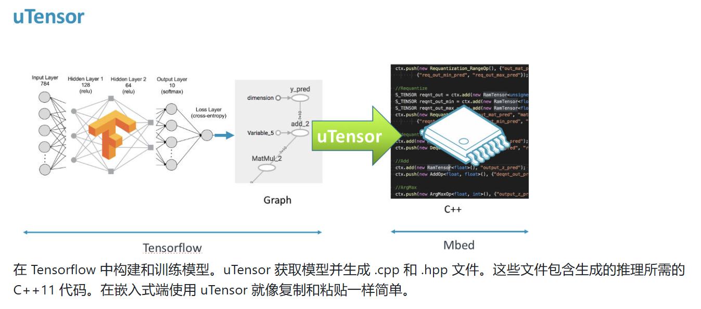

2024.9.12：
现在的思路是，别tm惦记yolov9了。
先把yolo的老版本（比如说v5）弄出来能用就可以~然后在电脑上可以通过摄像头进行实时的预测。
然后通过Tiny-Ml/uTensor做到可以把已经训练好（甚至不需要自己训练哈哈哈哈）的网络变成边缘设备中可以运行的.cpp文件。

最后把搞好的文件搞到电脑之外的设备上运行，看看能不能有用。。。

2024.9.13:
采用yolov5n作为所用网络。
发现如果使用jpg文件的路径作为输入的话，最终输出是一个专门的类，功能非常的全（可以做到报数、可视化等等，十分好用）
但是用电脑摄像头捕获帧的话，捕获的形式是NumPy数组，结果处理好NumPy数组（转化为Tensor，改为RGB，添加批维度等）后，作为输入进入yolov5n后所得的输出是一个list。tmd操蛋的是，这个list。。。既不能show，也不知道里面的信息都是什么东西，print了一大推害不明白都是干啥的。
经过两天草蛇灰线，追根溯源的研究源代码后，嗯，一点都没有头绪。。。。。。
刚刚给宇轩发了消息，记得他之前做了个很像的项目文件，如果能发给我参考一下就好了~~~

